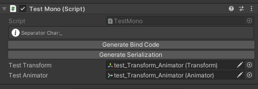
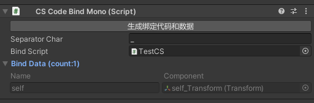

# 代码绑定工具

只需要添加简单的特性或脚本就能自动生成与预制体绑定的脚本代码，快捷易用，对原来的脚本没有任何入侵性，适用范围更广，同时支持Mono和CS两种模式，基于节点命名规则自动生成，支持子节点嵌套和数组，自定义命名规则，支持模糊匹配，取名更省事

## 交流QQ群：949482664

## 说明：

1.节点名字识别支持模糊匹配，比如需要绑定一个变量名为Self的Transform组件，节点名字Self_Tr就可以识别Tr为Transform

2.节点名字支持绑定多个不同组件，用分隔符连接起来即可，例如：Self_Transform_Button，Self_Tr_But等

3.节点全匹配，该节点所有脚本都进行绑定，把变量名和\*用分隔符连接起来即可，例如Self_*

4.支持数组生成，末尾用括号括上数字即可，Unity编辑器自带的复制粘贴生成的即可，例如(1)，(23)

5.支持嵌套，对于带有MonoCodeBindAttribute和CodeBindAttribute脚本的节点的子节点不会识别，方便列表使用

6.自定义命名规则，CodeBindNameTypeAttribute来注入不能修改的代码，CodeBindNameAttribute方便处理业务代码中频繁修改的类型

### 安装方式：
- Open Package Manager and Add package from git URL https://github.com/XuToWei/CodeBind.git.

### 该项目依赖以下收费插件（请自行购买安装）：
- [Odin Inspector](https://assetstore.unity.com/packages/tools/utilities/odin-inspector-and-serializer-89041) （编辑器扩展、工作流改善）

## 1.MonoBehaviour类型：

添加特性[MonoCodeBind](../Runtime/CSCodeBindAttribute.cs)即可，指定分隔符参数（可选）

### 使用方式：
```csharp
[MonoCodeBind('_')]
public partial class TestMono : MonoBehaviour
{

}
```


按钮Generate Bind Code：生成绑定代码

按钮Generate Serialization：生成绑定数据

## 2.CSCodeBindMono和ICSCodeBind组合：

[CSCodeBindMono](../Runtime/CSCodeBindMono.cs)保存绑定的数据，绑定类实现[ICSCodeBind](../Runtime/ICSCodeBind.cs)（非MonoBehaviour代码），不方便用MonoBehaviour时候使用，便利性上推荐尽量使用MonoBehaviour类型

### 使用方式：


拖入创建的C#脚本到BindScript(-_-!再也不用填写烦人的脚本路径)

```csharp
public partial class TestCS : ICSCodeBind
{
    //something
}
gameObject.GetCSCodeBindObject<TestCS>();//自带对象缓存
```


