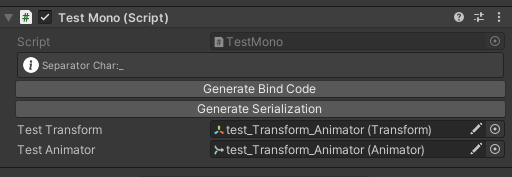
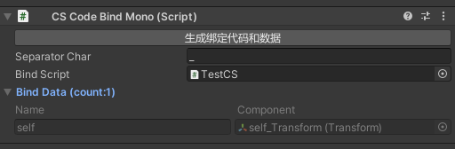

# CodeBind - Unity 组件绑定代码生成工具

<p align="center">
  
  
  
</p>

> 🚀 基于节点命名规则的智能代码生成工具，告别手动拖拽组件的繁琐操作！

CodeBind 是一款为 Unity 开发者设计的高效代码生成工具，通过简单的命名规则和特性标记，自动生成与预制体绑定的脚本代码。**零侵入性设计**，无需修改现有代码结构，即可大幅提升开发效率。

---

## ✨ 核心特性

### 🎯 智能命名识别
- **模糊匹配**：节点名称支持缩写识别，`Self_Tr` 自动识别为 `Transform`
- **多组件绑定**：单节点支持绑定多个组件，如 `Self_Transform_Button` 或 `Self_Tr_But`
- **全匹配模式**：使用通配符 `*` 绑定节点所有脚本，如 `Self_*`
- **数组支持**：通过括号标记自动生成数组，如 `Button (1)`、`Button (2)`

### 🔧 灵活配置
- **自定义分隔符**：根据团队命名习惯自由设置分隔字符
- **命名空间支持**：自动生成指定命名空间的代码
- **路径记忆**：自动记住上次使用的代码生成路径

### 🏗️ 两种工作模式
- **MonoBehaviour 模式**：直接在 MonoBehaviour 类上使用，最便捷的使用方式
- **纯 C# 模式**：通过 `ICSCodeBind` 接口支持非 MonoBehaviour 类，适合需要分离逻辑的场景

### 🎨 开发体验优化
- **零侵入性**：生成的代码使用 partial class，不影响原有代码结构
- **嵌套支持**：智能识别已绑定节点，避免重复绑定子节点，非常适合列表项（List Item）等场景
- **引用丢失提示**：自动检测绑定数据中的空引用，及时在 Inspector 中显示警告信息
- **多种操作方式**：支持 Inspector 面板按钮操作（Generate Bind Code / Generate Serialization）和右键快捷菜单快速创建

---

## 📦 安装方式

### 方法一：通过 Unity Package Manager（推荐）

1. 打开 Unity 编辑器
2. 打开 **Window > Package Manager**
3. 点击左上角 **+** 按钮
4. 选择 **Add package from git URL**
5. 输入：`https://github.com/XuToWei/CodeBind.git`
6. 点击 **Add**

### 方法二：手动下载

下载本仓库并将其解压到项目的 `Packages` 文件夹中。

---

## ⚙️ 依赖项

本项目依赖以下插件（需自行安装）：

- [**Odin Inspector**](https://assetstore.unity.com/packages/tools/utilities/odin-inspector-and-serializer-89041) - 增强编辑器界面和序列化功能

---

## 🚀 快速开始

### 方式一：MonoBehaviour 模式（推荐）

#### 1️⃣ 添加特性标记

在你的 MonoBehaviour 类上添加 `[MonoCodeBind]` 特性：

```csharp
using UnityEngine;
using CodeBind;

namespace Game
{
    [MonoCodeBind('_')] // '_' 为分隔符，可自定义
    public partial class TestMono : MonoBehaviour
    {
        // 你的业务代码
        private void Start()
        {
            // 自动生成的变量可以直接使用
            Self_Tr.position = Vector3.zero;
            Self_But.onClick.AddListener(OnButtonClick);
        }

        private void OnButtonClick()
        {
            Debug.Log("Button Clicked!");
        }
    }
}
```

#### 2️⃣ 设置节点命名

在 Unity Hierarchy 中按照命名规则设置节点名称：

```
TestGameObject
├── Self_Transform      // 绑定 Transform 组件
├── Self_Button         // 绑定 Button 组件
├── Title_Text          // 绑定 Text 组件
├── Items_Transform_*   // 绑定所有组件
└── ListItems
    ├── Item (0)        // 数组元素
    ├── Item (1)
    └── Item (2)
```

#### 3️⃣ 生成代码和数据

在 Inspector 面板中点击以下按钮：

- **Generate Bind Code** - 生成绑定代码（.Bind.cs 文件）
- **Generate Serialization** - 生成序列化数据（将组件引用保存到预制体）



#### 4️⃣ 生成的代码示例

工具会自动生成 `TestMono.Bind.cs` 文件：

```csharp
using UnityEngine;
using UnityEngine.UI;

namespace Game
{
    public partial class TestMono
    {
        [SerializeField] private Transform Self_Tr;
        [SerializeField] private Button Self_But;
        [SerializeField] private Text Title_Text;
        [SerializeField] private Component[] Items_Transform_Star;
        [SerializeField] private Transform[] Item_Array;
    }
}
```

---

### 方式二：纯 C# 模式

适用于不希望继承 MonoBehaviour 的场景。

#### 1️⃣ 创建 C# 类

```csharp
using CodeBind;

namespace Game
{
    public partial class TestCS : ICSCodeBind
    {
        public void Initialize()
        {
            // 使用生成的绑定变量
            Title_Text.text = "Hello CodeBind!";
        }
    }
}
```

#### 2️⃣ 添加 CSCodeBindMono 组件

在 GameObject 上添加 `CSCodeBindMono` 组件，并拖入你的 C# 脚本。



#### 3️⃣ 获取绑定对象

```csharp
// 自动缓存，无需担心性能
TestCS testCS = gameObject.GetCSCodeBindObject<TestCS>();
testCS.Initialize();
```

---

## 📝 命名规则详解

### 基础格式

```
[变量名]_[组件类型][_组件类型2...][(数组索引)]
```

### 组件类型缩写

支持模糊匹配，常用缩写包括：

| 全称 | 缩写示例 |
|------|---------|
| Transform | Tr, Trans |
| Button | But, Btn |
| Text | Txt |
| Image | Img |
| RectTransform | Rect, RectTr |
| GameObject | Go, Obj |

你也可以通过 `CodeBindNameAttribute` 和 `CodeBindNameTypeAttribute` 自定义命名规则。

### 示例

```
Player_Transform         → Transform Player_Tr
UI_Button_Image          → Button UI_But, Image UI_Img  
Items_*                  → Component[] Items_Star (绑定所有组件)
ListItem (0)             → Transform[] ListItem_Array (索引 0)
Child_Nested_Transform   → 如果 Child 有 CodeBind 特性，Nested 不会被识别
```

---

## 🛠️ 高级功能

### 右键快速生成 MonoBehaviour

1. 在 Hierarchy 中选中一个 GameObject
2. 右键选择 **GameObject > CodeBind > Mono Code Creator**
3. 在弹出窗口中设置：
   - **Code Name**：类名
   - **Code Namespace**：命名空间
   - **Code Path**：保存路径
   - **Separator Char**：分隔符
4. 点击 **Create Code File** 即可生成代码并自动添加到该 GameObject

### 自定义命名类型

通过 `CodeBindNameTypeAttribute` 扩展不可变的类型识别（应用于 static Dictionary 字段）：

```csharp
using System;
using System.Collections.Generic;
using UnityEngine;
using CodeBind;

public static class CustomBindTypeConfig
{
    [CodeBindNameType]
    public static Dictionary<string, Type> CustomBindTypes = new Dictionary<string, Type>
    {
        { "MyCustomComponent", typeof(MyCustomComponent) },
        { "MCC", typeof(MyCustomComponent) },
        { "PlayerController", typeof(PlayerController) },
        { "PC", typeof(PlayerController) }
    };
}
```

通过 `CodeBindNameAttribute` 处理业务代码中的自定义类型（应用于 Component 类）：

```csharp
using UnityEngine;
using CodeBind;

[CodeBindName("MyCustomComponent")]
public class MyCustomComponent : MonoBehaviour 
{ 
    // 你的自定义组件代码
}
```

---

## ❓ 常见问题

<details>
<summary><b>Q: 生成的代码文件在哪里？</b></summary>

生成的代码文件默认与原脚本同目录，文件名为 `原类名.Bind.cs`。

</details>

<details>
<summary><b>Q: 修改节点名称后需要重新生成吗？</b></summary>

是的，修改节点命名或结构后，需要重新点击 `Generate Bind Code` 和 `Generate Serialization`。

</details>

<details>
<summary><b>Q: 支持嵌套预制体吗？</b></summary>

支持。已经标记了 `MonoCodeBind` 或 `CodeBindAttribute` 的节点，其子节点不会被父级识别，避免重复绑定。这个特性非常适合处理列表场景，例如：ScrollView 中的每个 ListItem 可以有自己的绑定脚本，父级 ScrollView 的绑定不会影响到 ListItem 内部的节点。

</details>

<details>
<summary><b>Q: 是否支持其他编辑器扩展？</b></summary>

需要依赖 Odin Inspector，其他编辑器扩展不影响使用。

</details>

---

## 💬 交流与反馈

- **QQ 交流群**：949482664
- **问题反馈**：[GitHub Issues](https://github.com/XuToWei/CodeBind/issues)

---

## 📄 许可证

本项目基于 [MIT License](LICENSE) 开源。

---

## 🌟 为什么选择 CodeBind？

| 传统方式 | 使用 CodeBind |
|---------|--------------|
| ❌ 手动拖拽几十个组件到脚本 | ✅ 按命名规则自动生成 |
| ❌ 修改 UI 后重新拖拽 | ✅ 重新生成即可 |
| ❌ 代码与数据耦合 | ✅ partial class 分离生成代码 |
| ❌ 容易遗漏或拖错组件 | ✅ 自动识别，不会出错 |
| ❌ 团队协作易冲突 | ✅ 生成代码规范统一 |

---

<p align="center">
  ⭐ 如果这个工具对你有帮助，请给我们一个 Star！
</p>
